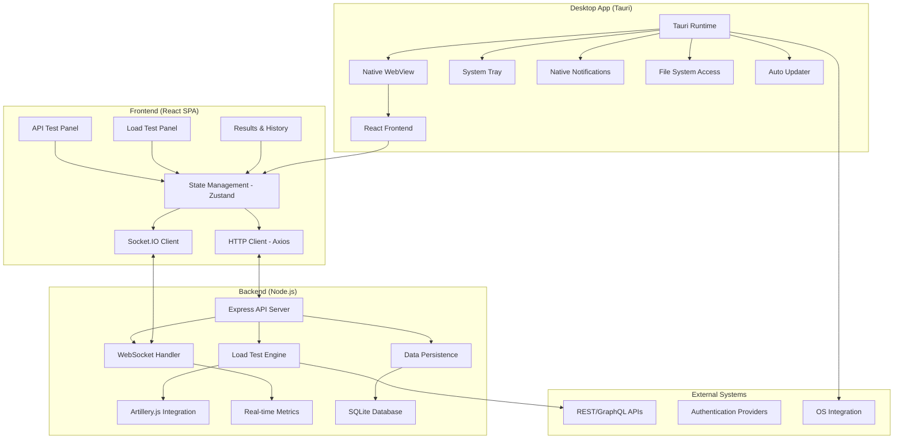
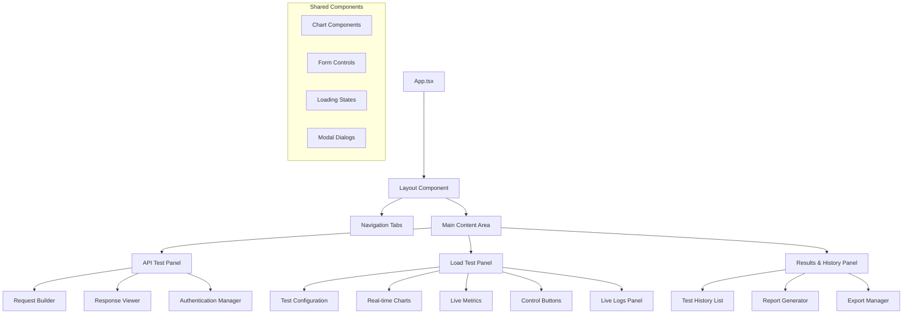
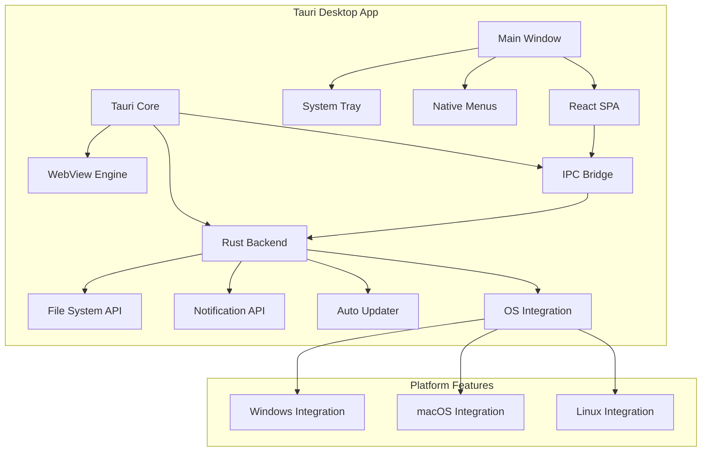

# Design Document - API Load Testing & Monitoring SPA

## Overview

The API Load Testing & Monitoring SPA is designed as a modern, professional-grade web application that provides comprehensive API testing and performance monitoring capabilities. The application follows a client-server architecture with a React-based frontend and Node.js backend, utilizing real-time communication for live monitoring and glassmorphism design principles for a polished user experience.

The system is architected to handle high-volume load testing (up to 10,000 concurrent virtual users) while maintaining responsive real-time visualizations and professional reporting capabilities. The design emphasizes modularity, scalability, and maintainability through clear separation of concerns and well-defined interfaces.

## Architecture

### High-Level Architecture



### Technology Stack Rationale

**Frontend Technologies:**
- **React 18+ with TypeScript**: Provides robust component architecture with type safety
- **Vite**: Fast development server and optimized production builds
- **Tailwind CSS**: Utility-first CSS framework enabling rapid UI development and consistent styling
- **Recharts**: React-native charting library optimized for real-time data visualization
- **Socket.IO Client**: Real-time bidirectional communication for live metrics
- **Zustand**: Lightweight state management with minimal boilerplate
- **React Hook Form**: Performant form handling with built-in validation
- **Framer Motion**: Smooth animations and transitions for professional UI feel

**Backend Technologies:**
- **Node.js with Express**: Scalable server architecture with extensive ecosystem
- **TypeScript**: Type safety and better developer experience
- **Socket.IO**: WebSocket implementation for real-time communication
- **Artillery.js**: Battle-tested load testing engine with extensive protocol support
- **SQLite**: Embedded database for development simplicity and data persistence
- **Helmet.js**: Security middleware for Express applications

**Desktop Technologies (Tauri):**
- **Tauri**: Rust-based framework for building secure, lightweight desktop applications
- **Rust**: Systems programming language for native desktop backend functionality
- **WebView**: Platform-native webview for rendering the React frontend
- **Native APIs**: OS-specific integrations for system tray, notifications, and file system access
- **Auto-updater**: Built-in update mechanism for seamless desktop app maintenance
- **Code Signing**: Platform-specific signing for secure distribution

## Components and Interfaces

### Frontend Component Architecture



### Core Frontend Components

#### 1. API Test Panel (`/src/components/ApiTestPanel`)
```typescript
interface ApiTestPanelProps {
  onTestComplete: (result: ApiTestResult) => void;
}

interface ApiTestResult {
  status: number;
  responseTime: number;
  responseBody: any;
  headers: Record<string, string>;
  timestamp: Date;
}
```

#### 2. Load Test Panel (`/src/components/LoadTestPanel`)
```typescript
interface LoadTestConfig {
  url: string;
  method: HttpMethod;
  headers: Record<string, string>;
  body?: string;
  auth?: AuthConfig;
  virtualUsers: number;
  rampUpTime: number;
  duration: number;
  requestRate: number;
  keepAlive: boolean;
  randomDelay: boolean;
}

interface LoadTestMetrics {
  requestsPerSecond: number;
  averageResponseTime: number;
  maxLatency: number;
  successRate: number;
  totalRequests: number;
  errors: ErrorMetric[];
  percentiles: PercentileData;
}
```

#### 3. Real-time Charts (`/src/components/Charts`)
```typescript
interface ChartProps {
  data: MetricDataPoint[];
  type: 'line' | 'area' | 'bar' | 'histogram';
  realTime: boolean;
  height?: number;
}

interface MetricDataPoint {
  timestamp: Date;
  value: number;
  label?: string;
  color?: string;
}
```

### Backend API Architecture

#### 1. REST API Endpoints
```typescript
// API Test Endpoints
POST /api/test/single - Execute single API test
GET /api/test/history - Retrieve test history

// Load Test Endpoints  
POST /api/loadtest/start - Start load test
POST /api/loadtest/stop - Stop running test
GET /api/loadtest/status - Get current test status
GET /api/loadtest/results/:id - Get test results

// Export Endpoints
GET /api/export/csv/:testId - Export results as CSV
GET /api/export/json/:testId - Export results as JSON
GET /api/export/pdf/:testId - Generate PDF report
```

#### 2. WebSocket Events
```typescript
// Client to Server Events
interface ClientEvents {
  'test:start': (config: LoadTestConfig) => void;
  'test:stop': () => void;
  'metrics:subscribe': () => void;
}

// Server to Client Events
interface ServerEvents {
  'metrics:update': (metrics: LoadTestMetrics) => void;
  'test:status': (status: TestStatus) => void;
  'logs:new': (logEntry: LogEntry) => void;
  'test:complete': (results: TestResults) => void;
}
```

### State Management Architecture

```typescript
// Zustand Store Structure
interface AppState {
  // API Test State
  apiTest: {
    config: ApiTestConfig;
    result: ApiTestResult | null;
    loading: boolean;
  };
  
  // Load Test State
  loadTest: {
    config: LoadTestConfig;
    metrics: LoadTestMetrics;
    isRunning: boolean;
    logs: LogEntry[];
  };
  
  // UI State
  ui: {
    activeTab: 'api' | 'load' | 'history';
    theme: 'dark' | 'light';
    showLogs: boolean;
    dashboardLayout: DashboardLayout;
  };
  
  // History State
  history: {
    tests: TestHistoryItem[];
    selectedTest: string | null;
  };
}
```

## Data Models

### Core Data Models

#### 1. Test Configuration Models
```typescript
interface ApiTestConfig {
  id: string;
  url: string;
  method: HttpMethod;
  headers: Record<string, string>;
  queryParams: Record<string, string>;
  body?: string;
  auth?: AuthConfig;
  timeout: number;
}

interface LoadTestConfig extends ApiTestConfig {
  virtualUsers: number;
  rampUpTime: number; // seconds
  duration: number; // minutes
  requestRate: number; // requests per second
  keepAlive: boolean;
  randomDelay: boolean;
  graphqlQuery?: string;
}

interface AuthConfig {
  type: 'bearer' | 'apikey' | 'basic';
  token?: string;
  apiKey?: string;
  username?: string;
  password?: string;
}
```

#### 2. Results and Metrics Models
```typescript
interface TestResults {
  id: string;
  testId: string;
  config: LoadTestConfig;
  startTime: Date;
  endTime: Date;
  summary: TestSummary;
  metrics: MetricDataPoint[];
  logs: LogEntry[];
  errors: ErrorSummary[];
}

interface TestSummary {
  totalRequests: number;
  successfulRequests: number;
  failedRequests: number;
  averageResponseTime: number;
  maxResponseTime: number;
  minResponseTime: number;
  percentiles: {
    p50: number;
    p90: number;
    p95: number;
    p99: number;
  };
  requestsPerSecond: number;
  errorRate: number;
}

interface LogEntry {
  timestamp: Date;
  level: 'info' | 'warn' | 'error';
  method: string;
  url: string;
  statusCode: number;
  responseTime: number;
  message: string;
}
```

#### 3. Database Schema (SQLite)
```sql
-- Test Configurations
CREATE TABLE test_configs (
  id TEXT PRIMARY KEY,
  name TEXT NOT NULL,
  config JSON NOT NULL,
  created_at DATETIME DEFAULT CURRENT_TIMESTAMP
);

-- Test Results
CREATE TABLE test_results (
  id TEXT PRIMARY KEY,
  config_id TEXT,
  start_time DATETIME,
  end_time DATETIME,
  summary JSON,
  created_at DATETIME DEFAULT CURRENT_TIMESTAMP,
  FOREIGN KEY (config_id) REFERENCES test_configs(id)
);

-- Metrics Data Points
CREATE TABLE metrics (
  id INTEGER PRIMARY KEY AUTOINCREMENT,
  test_result_id TEXT,
  timestamp DATETIME,
  metric_type TEXT,
  value REAL,
  metadata JSON,
  FOREIGN KEY (test_result_id) REFERENCES test_results(id)
);

-- Log Entries
CREATE TABLE logs (
  id INTEGER PRIMARY KEY AUTOINCREMENT,
  test_result_id TEXT,
  timestamp DATETIME,
  level TEXT,
  message TEXT,
  metadata JSON,
  FOREIGN KEY (test_result_id) REFERENCES test_results(id)
);
```

## Error Handling

### Frontend Error Handling Strategy

#### 1. API Error Handling
```typescript
// Axios Interceptor for Global Error Handling
axios.interceptors.response.use(
  (response) => response,
  (error) => {
    const errorHandler = new ApiErrorHandler();
    return errorHandler.handle(error);
  }
);

class ApiErrorHandler {
  handle(error: AxiosError): Promise<never> {
    if (error.response?.status === 401) {
      // Handle authentication errors
      this.handleAuthError();
    } else if (error.response?.status >= 500) {
      // Handle server errors
      this.handleServerError(error);
    } else if (error.code === 'NETWORK_ERROR') {
      // Handle network errors
      this.handleNetworkError();
    }
    
    return Promise.reject(this.formatError(error));
  }
}
```

#### 2. Component Error Boundaries
```typescript
class LoadTestErrorBoundary extends React.Component<Props, State> {
  static getDerivedStateFromError(error: Error): State {
    return { hasError: true, error };
  }

  componentDidCatch(error: Error, errorInfo: ErrorInfo) {
    console.error('Load test error:', error, errorInfo);
    // Send error to monitoring service
  }

  render() {
    if (this.state.hasError) {
      return <ErrorFallback error={this.state.error} />;
    }
    return this.props.children;
  }
}
```

### Backend Error Handling

#### 1. Express Error Middleware
```typescript
interface ApiError extends Error {
  statusCode: number;
  code: string;
  details?: any;
}

const errorHandler = (
  err: ApiError,
  req: Request,
  res: Response,
  next: NextFunction
) => {
  const statusCode = err.statusCode || 500;
  const response = {
    error: {
      message: err.message,
      code: err.code || 'INTERNAL_ERROR',
      ...(process.env.NODE_ENV === 'development' && { stack: err.stack })
    }
  };
  
  res.status(statusCode).json(response);
};
```

#### 2. Load Test Error Recovery
```typescript
class LoadTestManager {
  async startTest(config: LoadTestConfig): Promise<void> {
    try {
      await this.validateConfig(config);
      await this.initializeTest(config);
      await this.executeTest(config);
    } catch (error) {
      await this.handleTestError(error, config);
      throw error;
    }
  }

  private async handleTestError(error: Error, config: LoadTestConfig): Promise<void> {
    // Stop any running processes
    await this.cleanup();
    
    // Log error details
    this.logger.error('Load test failed', { error, config });
    
    // Notify connected clients
    this.socketManager.emit('test:error', {
      message: error.message,
      config: config.id
    });
  }
}
```

## Testing Strategy

### Frontend Testing Approach

#### 1. Unit Testing (Jest + React Testing Library)
```typescript
// Component Testing Example
describe('LoadTestPanel', () => {
  it('should start load test when configuration is valid', async () => {
    const mockStartTest = jest.fn();
    render(<LoadTestPanel onStartTest={mockStartTest} />);
    
    // Fill in test configuration
    fireEvent.change(screen.getByLabelText('API URL'), {
      target: { value: 'https://api.example.com' }
    });
    
    fireEvent.click(screen.getByText('Start Test'));
    
    await waitFor(() => {
      expect(mockStartTest).toHaveBeenCalledWith(
        expect.objectContaining({
          url: 'https://api.example.com'
        })
      );
    });
  });
});
```

#### 2. Integration Testing
```typescript
// API Integration Tests
describe('API Integration', () => {
  it('should handle load test lifecycle', async () => {
    const testConfig = createMockLoadTestConfig();
    
    // Start test
    const startResponse = await api.post('/api/loadtest/start', testConfig);
    expect(startResponse.status).toBe(200);
    
    // Check status
    const statusResponse = await api.get('/api/loadtest/status');
    expect(statusResponse.data.isRunning).toBe(true);
    
    // Stop test
    const stopResponse = await api.post('/api/loadtest/stop');
    expect(stopResponse.status).toBe(200);
  });
});
```

### Backend Testing Strategy

#### 1. Unit Testing (Jest)
```typescript
describe('LoadTestManager', () => {
  let loadTestManager: LoadTestManager;
  
  beforeEach(() => {
    loadTestManager = new LoadTestManager();
  });
  
  it('should validate test configuration', async () => {
    const invalidConfig = { url: 'invalid-url' };
    
    await expect(
      loadTestManager.validateConfig(invalidConfig)
    ).rejects.toThrow('Invalid URL format');
  });
});
```

#### 2. Load Testing Performance Tests
```typescript
describe('Load Test Performance', () => {
  it('should handle 1000 concurrent virtual users', async () => {
    const config = {
      url: 'http://localhost:3001/api/health',
      virtualUsers: 1000,
      duration: 60
    };
    
    const startTime = Date.now();
    const results = await loadTestManager.executeTest(config);
    const duration = Date.now() - startTime;
    
    expect(results.summary.totalRequests).toBeGreaterThan(1000);
    expect(duration).toBeLessThan(65000); // Should complete within 65 seconds
  });
});
```

### End-to-End Testing (Playwright)

```typescript
test('complete load testing workflow', async ({ page }) => {
  await page.goto('http://localhost:5173');
  
  // Navigate to load test panel
  await page.click('[data-testid="load-test-tab"]');
  
  // Configure test
  await page.fill('[data-testid="api-url"]', 'https://jsonplaceholder.typicode.com/posts');
  await page.selectOption('[data-testid="http-method"]', 'GET');
  await page.fill('[data-testid="virtual-users"]', '10');
  
  // Start test
  await page.click('[data-testid="start-test"]');
  
  // Wait for test to complete
  await page.waitForSelector('[data-testid="test-complete"]', { timeout: 30000 });
  
  // Verify results are displayed
  await expect(page.locator('[data-testid="success-rate"]')).toBeVisible();
  await expect(page.locator('[data-testid="response-time-chart"]')).toBeVisible();
});
```

## Security Considerations

### Authentication and Authorization
- Secure credential storage using browser's secure storage APIs
- HTTPS-only transmission of authentication tokens
- Credential encryption for local storage persistence
- Session timeout and automatic credential clearing

### API Security
- CORS configuration for allowed origins
- Rate limiting on API endpoints to prevent abuse
- Input validation and sanitization for all user inputs
- SQL injection prevention through parameterized queries

### Load Testing Security
- Target URL validation to prevent internal network scanning
- Request rate limiting to prevent accidental DDoS
- Secure handling of test credentials and API keys
- Audit logging for all load testing activities

## Performance Optimization

### Frontend Performance
- Code splitting for lazy loading of components
- Memoization of expensive calculations and chart rendering
- Virtual scrolling for large log displays
- Debounced input handling for real-time configuration updates
- Efficient WebSocket connection management

### Backend Performance
- Connection pooling for database operations
- Streaming responses for large datasets
- Memory-efficient metrics collection and storage
- Optimized Artillery.js configuration for high concurrency
- Background job processing for report generation

### Real-time Data Handling
- Efficient WebSocket message batching
- Client-side data aggregation to reduce server load
- Configurable update intervals based on test intensity
- Memory management for long-running tests

## Tauri Desktop Architecture

### Desktop Application Structure

The desktop version leverages Tauri to wrap the React SPA in a native desktop application while adding platform-specific features and integrations.



### Desktop-Specific Features

#### 1. System Tray Integration
```rust
// src-tauri/src/tray.rs
pub struct TrayManager {
    pub menu: SystemTrayMenu,
    pub status: TestStatus,
}

impl TrayManager {
    pub fn new() -> Self {
        let menu = SystemTrayMenu::new()
            .add_item(CustomMenuItem::new("start_test", "Start Load Test"))
            .add_item(CustomMenuItem::new("stop_test", "Stop Test"))
            .add_separator()
            .add_item(CustomMenuItem::new("show_app", "Show Application"))
            .add_item(CustomMenuItem::new("quit", "Quit"));
        
        Self { menu, status: TestStatus::Idle }
    }
}
```

#### 2. Native File Operations
```rust
// src-tauri/src/file_operations.rs
#[tauri::command]
pub async fn export_test_results(data: TestResults, format: ExportFormat) -> Result<String, String> {
    let file_path = match format {
        ExportFormat::PDF => generate_pdf_report(data).await?,
        ExportFormat::CSV => generate_csv_export(data).await?,
        ExportFormat::JSON => generate_json_export(data).await?,
    };
    
    Ok(file_path)
}

#[tauri::command]
pub async fn import_test_config() -> Result<TestConfiguration, String> {
    let file_path = FileDialogBuilder::new()
        .add_filter("JSON", &["json"])
        .pick_file()
        .await
        .ok_or("No file selected")?;
    
    let config = read_test_config(file_path).await?;
    Ok(config)
}
```

#### 3. Native Notifications
```rust
// src-tauri/src/notifications.rs
#[tauri::command]
pub fn send_test_notification(title: &str, body: &str, notification_type: NotificationType) {
    let notification = Notification::new()
        .title(title)
        .body(body)
        .icon(get_icon_for_type(notification_type))
        .show();
}

pub enum NotificationType {
    TestComplete,
    TestError,
    TestStarted,
    HighLatency,
}
```

#### 4. Auto-Update Configuration
```toml
# src-tauri/tauri.conf.json
{
  "updater": {
    "active": true,
    "endpoints": [
      "https://api.yourapp.com/updates/{{target}}/{{current_version}}"
    ],
    "dialog": true,
    "pubkey": "YOUR_PUBLIC_KEY_HERE"
  }
}
```

### Desktop Security Model

#### 1. Sandboxing Configuration
```toml
# src-tauri/tauri.conf.json
{
  "tauri": {
    "allowlist": {
      "fs": {
        "all": false,
        "readFile": true,
        "writeFile": true,
        "createDir": true,
        "scope": ["$APPDATA/api-load-tester/*", "$DOWNLOAD/*"]
      },
      "notification": {
        "all": true
      },
      "systemTray": {
        "all": true
      }
    }
  }
}
```

#### 2. IPC Security
```rust
// src-tauri/src/security.rs
#[tauri::command]
pub async fn secure_api_call(
    endpoint: String,
    credentials: EncryptedCredentials,
    app_handle: tauri::AppHandle,
) -> Result<ApiResponse, String> {
    // Decrypt credentials in secure context
    let decrypted = decrypt_credentials(credentials, &app_handle)?;
    
    // Validate endpoint URL
    validate_endpoint_url(&endpoint)?;
    
    // Execute API call with security headers
    execute_secure_request(endpoint, decrypted).await
}
```

### Platform-Specific Implementations

#### Windows Integration
- **File associations**: Register `.loadtest` files
- **Windows notifications**: Native toast notifications
- **Registry integration**: Store app preferences
- **Windows Store**: Distribution through Microsoft Store

#### macOS Integration
- **App bundle**: Proper `.app` structure with Info.plist
- **Keychain integration**: Secure credential storage
- **Notification Center**: Native macOS notifications
- **App Store**: Distribution through Mac App Store

#### Linux Integration
- **Desktop entry**: `.desktop` file for application launcher
- **System notifications**: D-Bus notification integration
- **Package managers**: `.deb`, `.rpm`, and `.AppImage` distributions
- **Freedesktop standards**: Following XDG specifications

### Build and Distribution

#### Development Setup
```bash
# Install Tauri CLI
cargo install tauri-cli

# Development mode
cargo tauri dev

# Build for production
cargo tauri build
```

#### CI/CD Pipeline
```yaml
# .github/workflows/desktop-build.yml
name: Desktop Build
on: [push, pull_request]

jobs:
  build-desktop:
    strategy:
      matrix:
        platform: [ubuntu-latest, windows-latest, macos-latest]
    
    runs-on: ${{ matrix.platform }}
    steps:
      - uses: actions/checkout@v3
      - name: Setup Rust
        uses: actions-rs/toolchain@v1
      - name: Build Tauri App
        run: cargo tauri build
      - name: Upload artifacts
        uses: actions/upload-artifact@v3
```

This design provides a solid foundation for implementing the API Load Testing & Monitoring SPA with professional-grade capabilities, scalable architecture, comprehensive testing coverage, and native desktop application support through Tauri integration.