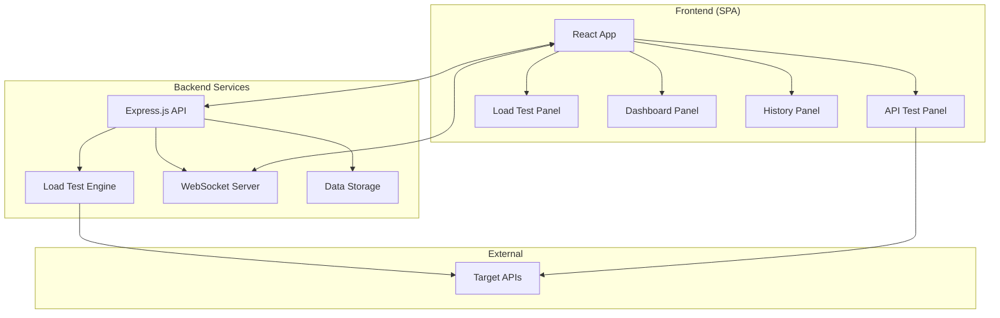

# Design Document

## Overview

The API Load Testing & Monitoring SPA is designed as a modern single-page application with a React.js frontend and Node.js backend. The architecture emphasizes real-time communication, scalable load testing, and intuitive user experience. The system uses WebSocket connections for real-time data streaming and integrates with established load testing engines for reliable performance testing.

## Architecture

### High-Level Architecture



### Technology Stack

**Frontend:**
- React.js 18+ with TypeScript for type safety
- Vite for fast development and building
- Tailwind CSS for utility-first styling
- Recharts for interactive data visualization
- Axios for HTTP client functionality
- Socket.IO client for real-time communication
- React Hook Form for form management
- Zustand for lightweight state management

**Backend:**
- Node.js with Express.js framework
- Socket.IO for WebSocket communication
- Artillery.js as the primary load testing engine
- SQLite for local data persistence (with option to upgrade to PostgreSQL)
- JSON Web Tokens for session management
- Helmet.js for security headers

## Components and Interfaces

### Frontend Components

#### 1. App Shell Component
- **Purpose:** Main application container with navigation and theme management
- **Props:** None (root component)
- **State:** Current active panel, theme preference, global loading state
- **Responsibilities:**
  - Route management between panels
  - Theme switching (dark/light mode)
  - Global error boundary
  - WebSocket connection management

#### 2. API Test Panel Component
- **Purpose:** Single API endpoint testing interface
- **Props:** None (uses global state)
- **State:** Request configuration, response data, loading state
- **Key Features:**
  - HTTP method selector (GET, POST, PUT, DELETE, PATCH)
  - URL input with validation
  - Headers editor (key-value pairs)
  - Query parameters editor
  - Request body editor with JSON syntax highlighting
  - Authentication configuration (Bearer, API Key, Basic Auth)
  - Response viewer with JSON formatting

#### 3. Load Test Configuration Component
- **Purpose:** Load test parameter configuration
- **Props:** API configuration from test panel
- **State:** Concurrent users, duration, ramp-up settings
- **Key Features:**
  - Slider controls for user count (1-10,000)
  - Duration picker (seconds/minutes/hours)
  - Ramp-up time configuration
  - Test scenario preview
  - Start/stop test controls

#### 4. Real-time Dashboard Component
- **Purpose:** Live performance metrics visualization
- **Props:** WebSocket connection, test status
- **State:** Real-time metrics, chart data, test progress
- **Key Features:**
  - Requests per second line chart
  - Response time distribution chart
  - Error rate percentage chart
  - Live metrics counters
  - Test progress indicator

#### 5. Test History Component
- **Purpose:** Historical test results management
- **Props:** None (fetches data on mount)
- **State:** Test history list, selected test details
- **Key Features:**
  - Paginated test history table
  - Test result summary cards
  - Export functionality (CSV/JSON)
  - Test comparison tools

### Backend API Interfaces

#### 1. API Test Endpoint
```typescript
POST /api/test-endpoint
{
  url: string;
  method: 'GET' | 'POST' | 'PUT' | 'DELETE' | 'PATCH';
  headers: Record<string, string>;
  queryParams: Record<string, string>;
  body?: string;
  auth?: {
    type: 'bearer' | 'apikey' | 'basic';
    credentials: Record<string, string>;
  };
}

Response: {
  statusCode: number;
  responseTime: number;
  headers: Record<string, string>;
  body: any;
  error?: string;
}
```

#### 2. Load Test Management
```typescript
POST /api/load-test/start
{
  target: ApiTestConfig;
  config: {
    concurrentUsers: number;
    duration: number;
    rampUpTime: number;
  };
}

Response: {
  testId: string;
  status: 'started' | 'error';
  message?: string;
}

POST /api/load-test/stop/:testId
Response: {
  status: 'stopped';
  finalResults: TestResults;
}
```

#### 3. WebSocket Events
```typescript
// Client to Server
'join-test': { testId: string }
'leave-test': { testId: string }

// Server to Client
'test-metrics': {
  testId: string;
  timestamp: number;
  requestsPerSecond: number;
  averageLatency: number;
  errorRate: number;
  activeUsers: number;
}

'test-complete': {
  testId: string;
  summary: TestSummary;
}
```

## Data Models

### API Test Configuration
```typescript
interface ApiTestConfig {
  id?: string;
  name: string;
  url: string;
  method: HttpMethod;
  headers: Record<string, string>;
  queryParams: Record<string, string>;
  body?: string;
  authentication?: AuthConfig;
  createdAt: Date;
  updatedAt: Date;
}

interface AuthConfig {
  type: 'bearer' | 'apikey' | 'basic';
  credentials: Record<string, string>;
}
```

### Load Test Configuration
```typescript
interface LoadTestConfig {
  id: string;
  apiConfig: ApiTestConfig;
  concurrentUsers: number;
  duration: number; // in seconds
  rampUpTime: number; // in seconds
  createdAt: Date;
}
```

### Test Results
```typescript
interface TestResults {
  id: string;
  testConfigId: string;
  startTime: Date;
  endTime: Date;
  status: 'running' | 'completed' | 'stopped' | 'failed';
  summary: {
    totalRequests: number;
    successfulRequests: number;
    failedRequests: number;
    averageLatency: number;
    p95Latency: number;
    p99Latency: number;
    maxLatency: number;
    requestsPerSecond: number;
    errorRate: number;
  };
  metrics: MetricPoint[];
}

interface MetricPoint {
  timestamp: number;
  requestsPerSecond: number;
  averageLatency: number;
  errorRate: number;
  activeUsers: number;
}
```

## Error Handling

### Frontend Error Handling
1. **API Request Errors:**
   - Network timeouts: Display retry option with exponential backoff
   - 4xx errors: Show user-friendly validation messages
   - 5xx errors: Display generic error with option to report issue

2. **WebSocket Connection Errors:**
   - Connection loss: Automatic reconnection with visual indicator
   - Message parsing errors: Log to console, continue operation
   - Authentication errors: Redirect to re-authentication

3. **Form Validation:**
   - Real-time validation for URL format, required fields
   - Clear error messages with suggestions for correction
   - Prevent submission with invalid data

### Backend Error Handling
1. **Load Test Engine Errors:**
   - Engine startup failures: Return descriptive error messages
   - Target API unreachable: Validate connectivity before test start
   - Resource exhaustion: Implement rate limiting and resource monitoring

2. **Data Persistence Errors:**
   - Database connection issues: Implement connection pooling and retry logic
   - Data validation errors: Return structured error responses
   - Storage quota exceeded: Implement data retention policies

3. **WebSocket Errors:**
   - Client disconnection: Clean up resources and stop unnecessary processing
   - Message broadcasting failures: Implement message queuing for reliability

## Testing Strategy

### Unit Testing
- **Frontend:** Jest + React Testing Library for component testing
- **Backend:** Jest + Supertest for API endpoint testing
- **Coverage Target:** 80% code coverage minimum

### Integration Testing
- **API Integration:** Test complete request/response cycles
- **WebSocket Communication:** Test real-time data flow
- **Load Test Engine:** Verify Artillery.js integration

### End-to-End Testing
- **User Workflows:** Playwright for complete user journey testing
- **Performance Testing:** Lighthouse CI for frontend performance
- **Load Testing Validation:** Self-testing using the application

### Performance Testing
- **Frontend Performance:**
  - Bundle size optimization (target: <500KB gzipped)
  - First Contentful Paint <2s
  - Time to Interactive <3s

- **Backend Performance:**
  - API response times <200ms for single requests
  - WebSocket message latency <100ms
  - Support for 100+ concurrent WebSocket connections

### Security Testing
- **Input Validation:** Test for XSS, injection attacks
- **Authentication:** Verify secure credential handling
- **HTTPS Enforcement:** Ensure all communications are encrypted
- **Rate Limiting:** Test API abuse prevention

## Deployment Architecture

### Development Environment
- Frontend: Vite dev server with hot reload
- Backend: Node.js with nodemon for auto-restart
- Database: SQLite for simplicity

### Production Environment
- Frontend: Static files served via CDN (Vercel/Netlify)
- Backend: Node.js application on cloud platform (Railway/Render)
- Database: PostgreSQL for production reliability
- WebSocket: Sticky sessions for load balancer compatibility

### Monitoring and Observability
- Application metrics: Response times, error rates, user activity
- Infrastructure metrics: CPU, memory, network usage
- Log aggregation: Structured logging with correlation IDs
- Error tracking: Automated error reporting and alerting